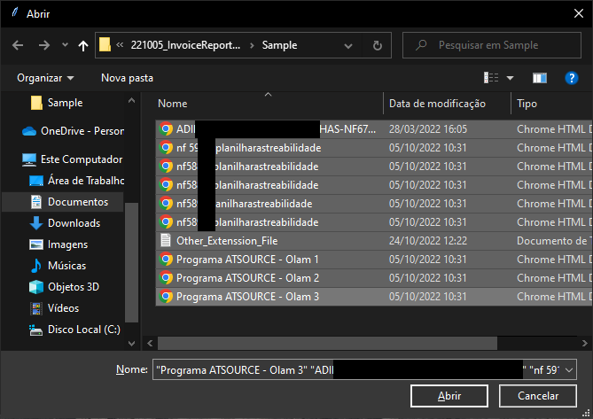
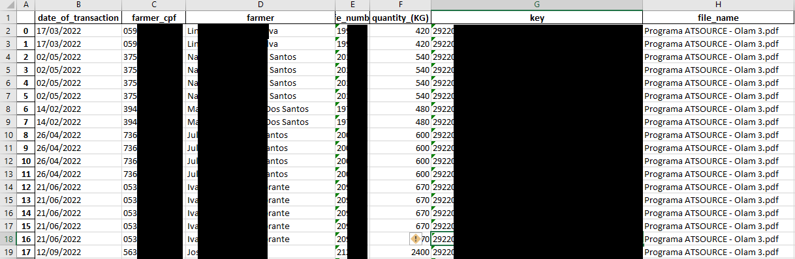

### Automatic NFe Report Reader
___

- [Version/Donwload](#version-and-download)
- [Problem](#problem)
- [Solution](#solution)
- [How it Works](#how-it-works)
- [Technical Info](#technical-information)


<br>

### Problem:
---

- The continuous, repetitive and time consuming work of manually copy information from eletronic invoice report and inserting this data into excel sheets for BI purpose DashBoards.

<br>

### Solution:
---

- The software is capable of reading pdf files and return a excel sheet for the user.
    - Multiple Reports at once.
    - Multiple Reports in one single pdf file.
    - Increment the existing sheet with more files.
    - Return feedback if the selected file are not readable by the softaware.

<br>

### Cost
---

- The use of the software is free for it is made with free programming language and open libraries.
    - Software [info](#technical-information) below.

<br>

### How it Works
---

- Fork It / Clone it

- Execute "main.py" or
```powershell
pip install -r requirements.txt
pip install pyinstaller
pyintaller --onefile main.py

main.exe
```


<label for="execute" style="margin-left: 30px">Execute the NFe_Report Reader</label>

<br>

- Choose the files to be read


<label for="select" style="margin-left: 30px">Choose the reports you want to read</label>

<br>

- If there are alerts read them and then click ok to continue.


<label for="alert" style="margin-left: 30px">The alert show the name of unreadable files</label>

<br>

- Open the ready Excel file.
 <br>


<label for="done" style="margin-left: 30px">Open the Invoice Report file</label>

<br>

- Observation: If there is any need to reset the sheet you can delete both "Invoice Report" and "Main_do_not_use", the software will create a clean new one.

<br>


<label for="excel_sheet" style="margin-left: 30px">The excel file should look like this.</label>

<br>

<br>

### Technical Information
---

- **Last Update** 
    - 19 NOV 2022 version 2.1
        - Corrected for absency of character in the name field for isolated farmers

- **Language:** Python 3.9.12

- **libs:** certifi==2022.9.24; charset-normalizer==2.1.1; ci-info==0.3.0; click==8.1.3; colorama==0.4.5; configobj==5.0.6; configparser==5.3.0; easygui==0.98.3; et-xmlfile==1.1.0; etelemetry==0.3.0; filelock==3.8.0; fitz==0.0.1.dev2; future==0.18.2; httplib2==0.20.4; idna==3.4; isodate==0.6.1; looseversion==1.0.1; lxml==4.9.1; networkx==2.8.7; nibabel==4.0.2; nipype==1.8.5; numpy==1.23.3; openpyxl==3.0.10; packaging==21.3; pandas==1.5.0; pathlib==1.0.1; prov==2.0.0; pydot==1.4.2; PyMuPDF==1.20.2; pyparsing==3.0.9; python-dateutil==2.8.2; pytz==2022.4; pyxnat==1.5; rdflib==6.2.0; regex==2022.9.13; requests==2.28.1; scipy==1.9.2; simplejson==3.17.6; six==1.16.0; tk==0.1.0; traits==6.3.2; urllib3==1.26.12

- **Compatibility:** Windows 8 and newer.

- **Developed for:** OFI - Olam Food Ingredients - Brazil
    - [linkedIn](https://www.linkedin.com/company/ofi-brasil/mycompany/)

- **Developer:** Felipe Baldim Guerra 
    - [GitHub](https://github.com/FelipeGuerra5) 
    - [LinkedIn](https://www.linkedin.com/in/felipe-baldim-guerra-858556127/)
    - [Support Email](felipe.guerra@ofi.com)

### **Version and Download**

- Version 2.3.0
- [Nfe_ReportReader_2.3.0](#https://github.com/FelipeGuerra5/PDF_NFe_Report_Reader/blob/main/dist/main.exe)

<br>
